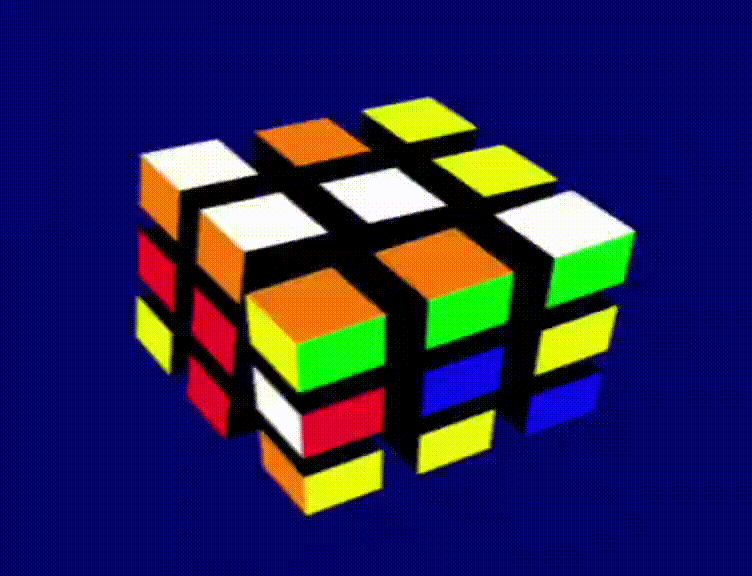

<p align="center">
<a href="url"></a>
</p>

# Rubik's Cube

Implementing a Rubik's Cube with OpenGL.

Here, I put together the [OpenGL tutorial](http://www.opengl-tutorial.org/) and [game engine series](https://www.youtube.com/playlist?list=PLlrATfBNZ98dC-V-N3m0Go4deliWHPFwT) to practice. Feel free to use this code however you want, although you shouldn't trust it too much... If you have any questions or ideas, please don't hesitate to contact me.

# Requirements

The [OpenGL tutorial](http://www.opengl-tutorial.org/beginners-tutorials/tutorial-1-opening-a-window/) specifies the following libraries as requirements:

``` bash
cmake make g++ libx11-dev libxi-dev libgl1-mesa-dev libglu1-mesa-dev libxrandr-dev libxext-dev libxcursor-dev libxinerama-dev libxi-dev
```

Additionally, your graphics card must support OpenGL 4.6. [Yvo Menezes](https://github.com/yvomenezes) made the branch `osx` with some changes to use OpenGL 4.1 on MacOS. If in doubt, just follow the steps below and the tests will tell you whether the OpenGL context can be created successfully or not.

# Quick Start

1. Clone this repo:

```bash
git clone https://github.com/idiasdas/rubiks_cube.git
```

2. Initialize the submodules:

```bash
git submodule update --init
```

3. Configure CMake:

```bash
# You can also use -DCMAKE_BUILD_TYPE=Release to have more performance
# You can specify a directory different than "build" if you want it for some reason
cmake -B build -DCMAKE_BUILD_TYPE=Debug
```

4. Build the project:

```bash
# In the directory build/
make
```

5. Run tests:

```bash
# In the directory build/
ctest
```

6. Run executable

```bash
# In the directory build/
./rubiks_cube
```

> [!NOTE]
> You need to run the executable from within the build directory you specified in step 3. When you build this project, it saves the relative path from the chosen build directory to the `utils/` directory. This allows the program to load the shaders during runtime. I should do something better than this but yeah...

# External Software

This project uses:

- glad
- glfw
- glm
- spdlog

You can find all external software in **ext/**.

# Controls

The following are the commands you can use:

|Keys|Action|
|-|-|
|Esc| Close program|
|Mouse 1| Cast ray (DEBUG Feature)|
|Mouse 2| While pressed, move the mouse to move the cube |
|Mouse Scroll| Control zoom|
|NumPad 2| Rotate bottom face clockwise|
|NumPad 8| Rotate top face clockwise|
|NumPad 4| Rotate left face clockwise|
|NumPad 6| Rotate right face clockwise|
|NumPad 5| Rotate front face clockwise|
|NumPad 0| Rotate back face clockwise|
|Left Shift + NumPad 0, 2, 4, 5, 6, 8 | Rotate face counterclockwise|
|R| Reset cube to initial state|

# Goals

- [x] Render Cube
- [x] Fly around
- [x] Move pieces
- [x] Movement animation
- [x] Animation queue
- [x] Dynamic resize
- [x] Event system
- [x] Log system
- [ ] ImGui control and debug window
- [x] Varying move animation speed
- [ ] GIF generator
- [ ] Solver
- [ ] Rotate faces with the mouse
    - [x] Ray cast
    - [x] Ray picking (RAY OBB intersection)
    - [ ] Face rotation with mouse vector
    - [ ] Rotation rounding

# Updates

### 31/07

- New camera: Before, the camera was free so you could fly around. Now, it is always looking at the cube's center. It moves on the sphere centered at the cube. Hold `Mouse 2` and move the mouse to move the camera. Use the `Mouse Scroll` to control the distance between the camera and the cube.
